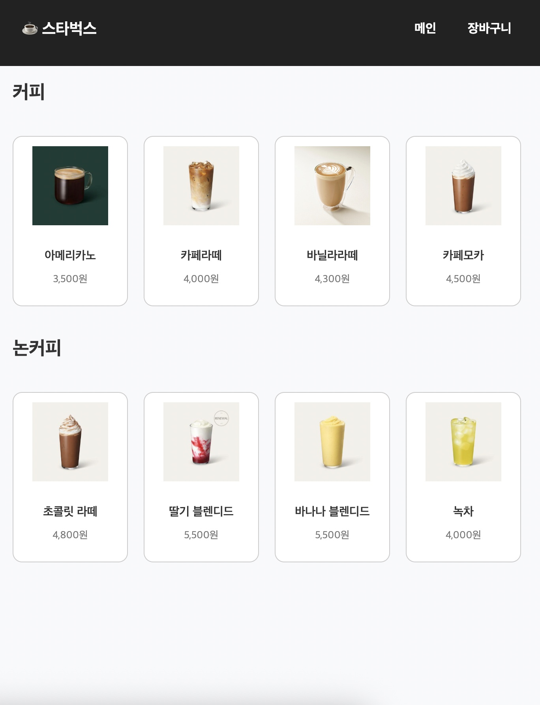
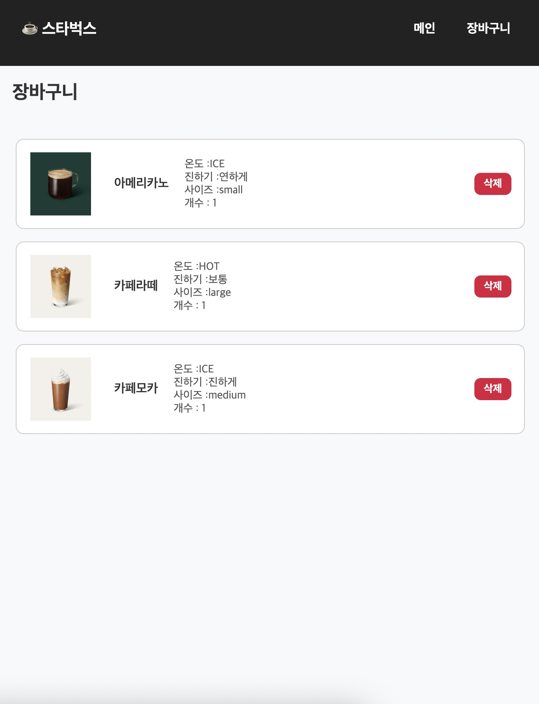

# ☕️ 스타벅스 메뉴 주문 시스템

React와 Vite를 사용하여 구현한 스타벅스 스타일의 카페 메뉴 주문 시스템입니다.  
음료를 선택하면 옵션(온도, 진하기, 사이즈)을 설정하고 장바구니에 담을 수 있습니다.  
[배포 링크 바로가기 🔗](https://cafe-order-system-iota.vercel.app)

---

## ✨ 주요 기능

- ✅ 메뉴 목록 보기 (카테고리별)
- ✅ 음료 클릭 시 옵션 선택 모달
- ✅ 옵션/수량 선택 후 장바구니 담기
- ✅ 장바구니 목록 확인 및 삭제

---

## 📸 미리보기

### 메인 메뉴



### 장바구니



---

## 🛠 사용 기술

- React (with Vite)
- SCSS (컴포넌트 단위 스타일링)
- React Router DOM
- Vercel 배포

---

## ⚙️ 설치 및 실행 방법

````bash
# 1. 레포지토리 클론
git clone https://github.com/hannalee7222/Cafe_Order_System.git
cd Cafe_Order_System

# 2. 패키지 설치
npm install

# 3. 개발 서버 실행
npm run dev

---

## 🚀 배포
해당 프로젝트는 Vercel을 통해 배포되었습니다.

🔗 


---

## 📂 프로젝트 구조

```bash
Cafe_Order_System/
├── public/
├── src/
│   ├── assets/       # 이미지 및 메뉴 데이터
│   ├── components/   # Item, Menu, Cart, Modal 등 UI 컴포넌트
│   ├── App.jsx
│   └── main.jsx
├── .gitignore
├── index.html
├── package.json
└── vite.config.js
````
